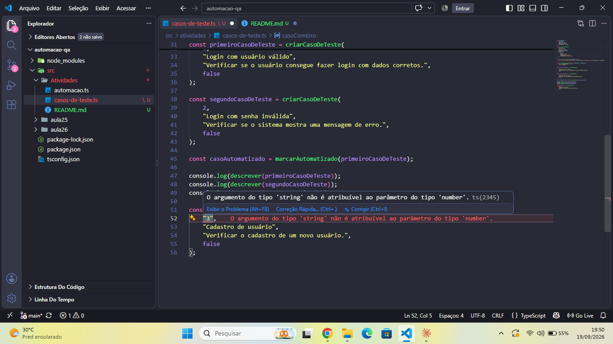

# Atividade - Casos de Teste

## O que foi feito

Nesta atividade foi criado um tipo chamado `CasoDeTeste` usando TypeScript.

O tipo possui quatro propriedades:

* `id`: number
* `titulo`: string
* `descrição`: string
* `automatizado`: boolean

Também foram criadas três funções:

* `criarCasoDeTeste`: responsável por criar um caso de teste.
* `descrever`: responsável por mostrar as informações do caso de teste.
* `marcarAutomatizado`: responsável por alterar o valor de `automatizado` para `true`.

Depois foram criadas algumas constantes para utilizar as funções e testar o código.

Também foi criado um erro de tipo de propósito para verificar a tipagem do TypeScript.

## Como rodar

Para executar o código, primeiro é necessário abrir o terminal na pasta do projeto `automacao-qa`.

Depois, executar o seguinte comando:

```bash
npx ts-node src/atividades/casos-de-teste.ts
```

## Erro de tipo provocado

O erro foi provocado na função `criarCasoDeTeste`.

A função espera que o primeiro parâmetro, que representa o `id`, seja um número (`number`).

Porém, foi passado o valor `"3"`, que é um texto (`string`).

O código usado foi:

```ts
const casoComErro = criarCasoDeTeste(
    "3",
    "Cadastro de usuário",
    "Verificar o cadastro de um novo usuário.",
    false
);
```

O TypeScript identifica que o tipo está errado e apresenta uma mensagem parecida com:

```text
Argument of type 'string' is not assignable to parameter of type 'number'.
```

## Print do erro

O print mostrando o erro está abaixo:


